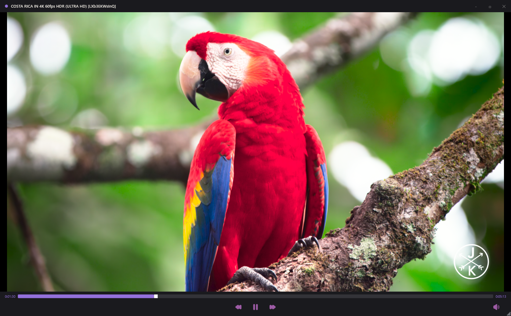

# 🎬 Iris MPV

> I couldn't find a single modern-looking mpv frontend for Windows. Every existing one looks like it was designed in 2009. So I built one.

A clean, minimal, native Windows video player built on top of the most powerful playback engine on the planet — **libmpv**.


---

---
## ✨ Why Iris?

mpv is the best video player engine in existence. Hardware decoding, HDR tone mapping, high quality scaling, Lua scripting — it powers IINA on macOS, Celluloid on Linux, and even some professional studio pipelines. But on Windows? Every frontend looks abandoned.

Iris is built from scratch as a proper native Windows application — no Electron, no WebView, no compromises. Just WPF talking directly to libmpv via P/Invoke.

---

## 🚀 Features

- 🎥 **Real mpv playback** — libmpv embedded directly via Win32 HwndHost
- ⚡ **Hardware decoding** — NVDEC, DXVA2, D3D11VA auto-selected for your GPU
- 🖥️ **Native Windows app** — built with WPF on .NET 10, no web wrappers
- 🎨 **Custom chromeless UI** — no ugly OS titlebar, fully custom dark theme
- 📂 **Drag & drop** — drop any video file to play instantly
- ▶️ **Playback controls** — play, pause, seek forward/backward
- 🔊 **Volume control** — mute/unmute with icon feedback
- ⏱️ **Seek bar** — click or drag to seek with live timestamps
- 🏷️ **Filename in titlebar** — always know what's playing
- 🔁 **Replay on end** — video restarts cleanly when finished

---

## 📋 Roadmap

- [ ] Keyboard shortcuts (Space, arrows, F for fullscreen)
- [ ] Fullscreen mode with overlay controls
- [ ] Volume slider
- [ ] File open dialog
- [ ] Status bar (codec, resolution, fps)
- [ ] Playlist support
- [ ] Remember window size and position
- [ ] Settings page (default volume, hwdec, keybindings)
- [ ] Double-click file association

---

## 🛠️ Building

### Prerequisites

- [.NET 10 SDK](https://dotnet.microsoft.com/download)
- [libmpv-2.dll](https://sourceforge.net/projects/mpv-player-windows/files/libmpv/) — download `mpv-dev-x86_64-v3-*`, extract and place `libmpv-2.dll` in `Iris/lib/`

### Steps

```bash
git clone https://github.com/imujjwalaryan/Iris-MPV.git
cd Iris-MPV
```

Place `libmpv-2.dll` in `Iris/lib/` then:

```bash
dotnet build Iris/Iris.csproj
```

Or open the solution in **JetBrains Rider** or **Visual Studio 2022+** and hit Run.

---

## 📦 Dependencies

| Package | Purpose |
|---|---|
| `libmpv-2.dll` | mpv playback engine (not included, download separately) |
| `SharpVectors` | SVG icon rendering in WPF |

---

## 🎮 Usage

1. Launch Iris
2. Drag and drop any video file onto the window
3. Use the controls at the bottom to play, pause, seek

---

## 👤 Author

**Ujjwal Aryan**
[@imujjwalaryan](https://github.com/imujjwalaryan)

---

## 📄 License

MIT — do whatever you want, just keep the copyright notice.

---

<p align="center">Built with frustration and C#</p>
